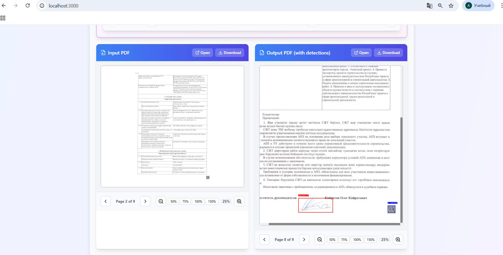
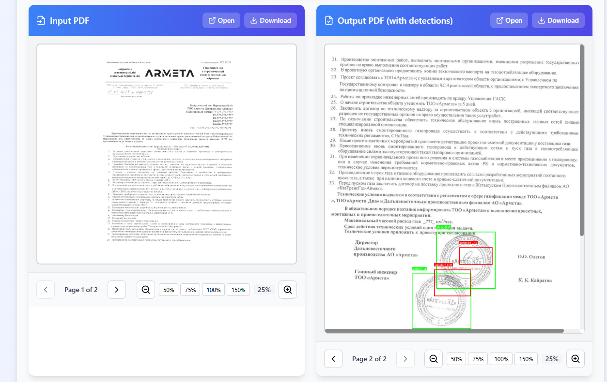
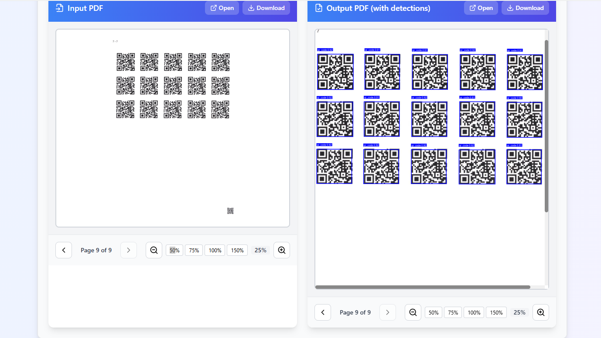

# InnovateX - PDF Object Detection Platform

A full-stack web application for detecting and annotating objects (signatures, stamps, QR codes) in PDF documents using YOLOv11 object detection model.


## 📸 Detection Examples

Here are some examples of object detection results on PDF documents:

### Example 1


### Example 2


### Example 3


## 🚀 Features

- **PDF Upload & Processing**: Drag-and-drop interface for PDF files
- **YOLOv11 Object Detection**: Detects signatures, stamps, and QR codes with high accuracy
- **Configurable Detection**: Adjustable confidence threshold, IOU threshold, and max detections
- **Real-time Processing**: Fast PDF processing with detailed reports
- **Interactive PDF Viewer**: Side-by-side view of original and annotated PDFs
- **Advanced Preprocessing**: Optional CLAHE, denoising, and thresholding for better detection
- **Two-Pass Detection**: Enhanced QR code detection in bottom-right corners
- **Beautiful UI**: Modern, responsive interface built with React and Tailwind CSS

## 📋 Tech Stack

### Backend
- **Django 4.2** - Python web framework
- **Django REST Framework** - RESTful API
- **Ultralytics YOLOv11** - Object detection model
- **PyMuPDF (fitz)** - PDF processing
- **Pillow** - Image manipulation
- **OpenCV** - Image preprocessing

### Frontend
- **React 18** - UI framework
- **Vite** - Build tool
- **Tailwind CSS** - Styling
- **react-pdf** - PDF rendering in browser
- **Axios** - HTTP client
- **Lucide React** - Icons

## 📁 Project Structure

```
innovatexhackathon/
├── backend/
│   ├── pdf_processor/          # Django project settings
│   │   ├── settings.py         # Configuration (MODEL_PATH = best.pt)
│   │   ├── urls.py
│   │   └── wsgi.py
│   ├── api/                    # API app
│   │   ├── views.py           # API endpoints
│   │   ├── serializers.py     # Data validation
│   │   ├── pdf_processor.py   # Core PDF processing logic
│   │   └── urls.py
│   ├── manage.py
│   └── requirements.txt
├── frontend/
│   ├── src/
│   │   ├── components/        # React components
│   │   │   ├── PDFViewer.jsx
│   │   │   ├── Report.jsx
│   │   │   └── ThresholdControls.jsx
│   │   ├── App.jsx
│   │   ├── main.jsx
│   │   └── index.css
│   ├── package.json
│   ├── vite.config.js
│   └── tailwind.config.js
├── best.pt                    # YOLOv11 trained model (required)
├── requirements.txt           # Root requirements
└── README.md
```

## 🛠️ Installation & Setup

### Prerequisites

- **Python 3.8+**
- **Node.js 16+** and npm
- **best.pt** model file (YOLO trained model) - must be in project root

### 1. Clone Repository

```bash
git clone https://github.com/adiletexe/innovatex.git
cd innovatex
```

### 2. Backend Setup

```bash
# Navigate to backend directory
cd backend

# Create virtual environment (recommended)
python -m venv venv

# Activate virtual environment
# On Windows:
venv\Scripts\activate
# On macOS/Linux:
source venv/bin/activate

# Install dependencies
pip install -r requirements.txt

# Run migrations
python manage.py migrate

# Start Django development server
python manage.py runserver
```

The backend will be running at `http://localhost:8000`

### 3. Frontend Setup

```bash
# Navigate to frontend directory (from project root)
cd frontend

# Install dependencies
npm install

# Start development server
npm run dev
```

The frontend will be running at `http://localhost:5173` (Vite default port)

### 4. Model File

Ensure `best.pt` is in the project root directory. The model path is configured in `backend/pdf_processor/settings.py`:

```python
MODEL_PATH = BASE_DIR.parent / 'best.pt'
```

## 🎯 Usage

1. **Start Services**: 
   - Backend: `cd backend && python manage.py runserver`
   - Frontend: `cd frontend && npm run dev`

2. **Open Application**: Navigate to `http://localhost:5173` in your browser

3. **Upload PDF**: 
   - Click the upload area or drag and drop a PDF file
   - Maximum file size: 50MB

4. **Adjust Detection Parameters** (optional):
   - **Confidence Threshold** (0.1-0.95): Higher values reduce false positives
   - **IOU Threshold** (0.1-0.9): Controls overlap threshold for duplicate removal
   - **Max Detections** (10-500): Maximum objects to detect per page
   - **Preprocessing Options**: Enable CLAHE, denoising, or thresholding for better detection

5. **Process PDF**: Click the "Process PDF" button

6. **View Results**:
   - **Report**: Summary statistics and page-by-page breakdown
   - **Input PDF**: Original document viewer
   - **Output PDF**: Annotated document with bounding boxes

## 🎨 Detection Classes

The model detects three types of objects:
- **Signatures** (Red boxes)
- **Stamps** (Green boxes)
- **QR Codes** (Blue boxes)

## 📡 API Endpoints

### POST `/api/process-pdf/`

Process a PDF file with object detection.

**Request:**
- Method: `POST`
- Content-Type: `multipart/form-data`
- Body:
  - `pdf_file` (file, required): PDF file to process
  - `confidence_threshold` (float, optional): Default 0.5
  - `iou_threshold` (float, optional): Default 0.45
  - `max_detections` (int, optional): Default 100
  - `use_clahe` (boolean, optional): Enable CLAHE preprocessing
  - `use_denoise` (boolean, optional): Enable denoising
  - `use_threshold` (boolean, optional): Enable adaptive thresholding

**Response:**
```json
{
  "success": true,
  "input_pdf_url": "http://localhost:8000/media/uploads/input_xxx.pdf",
  "output_pdf_url": "http://localhost:8000/media/outputs/output_xxx.pdf",
  "report": {
    "total_pages": 5,
    "total_detections": 12,
    "detections_per_class": {
      "signature": 8,
      "stamp": 3,
      "qr_code": 1
    },
    "page_stats": [...],
    "model_classes": {...},
    "preprocessing": {...},
    "thresholds": {...}
  }
}
```

## 🔧 Development

### Backend Development

```bash
cd backend
python manage.py runserver
```

### Frontend Development

```bash
cd frontend
npm run dev
```

### Building for Production

**Frontend:**
```bash
cd frontend
npm run build
```

The built files will be in `frontend/dist/`

**Backend:**
```bash
cd backend
# Use production WSGI server (gunicorn, uwsgi, etc.)
```

## 🐛 Troubleshooting

### Model not found error
- Ensure `best.pt` is in the project root directory
- Check the `MODEL_PATH` setting in `backend/pdf_processor/settings.py`
- Verify file permissions

### CORS errors
- Make sure both backend and frontend servers are running
- Check CORS settings in `backend/pdf_processor/settings.py`
- Verify API URL in frontend configuration

### PDF not displaying
- Ensure the pdf.js worker is loading correctly
- Check browser console for errors
- Verify PDF file is not corrupted

### Large PDF files
- Increase the file size limit in `backend/api/serializers.py` if needed
- Consider adding pagination for PDFs with many pages
- Monitor memory usage during processing

### GPU/CUDA issues
- Install CUDA toolkit if using GPU acceleration
- Check PyTorch CUDA installation: `python -c "import torch; print(torch.cuda.is_available())"`
- Model will fall back to CPU if GPU is unavailable

## 📊 Model Performance

The `best.pt` model is trained on a merged dataset containing:
- **Signatures**: 4,167 training images
- **Stamps**: 3,508 training images  
- **QR Codes**: 2,132 training images

**Total Dataset:**
- Training: 5,640 images
- Validation: 1,067 images
- Test: 565 images

## 🚀 Deployment

### Backend (Django)

1. Set up production WSGI server (gunicorn, uwsgi)
2. Configure environment variables
3. Set up static file serving
4. Configure database (PostgreSQL recommended for production)
5. Set up reverse proxy (nginx)

### Frontend (React/Vite)

1. Build production bundle: `npm run build`
2. Serve `dist/` folder with web server (nginx, Apache)
3. Configure API endpoint URLs

### Docker (Optional)

```dockerfile
# Example Dockerfile structure
FROM python:3.10
# ... backend setup
```

## 📝 License

MIT

## 👥 Credits

- **YOLOv11** model by Ultralytics
- **PDF processing** with PyMuPDF
- **UI icons** by Lucide React
- Built for InnovateX Hackathon

## 🔗 Links

- Repository: https://github.com/adiletexe/innovatex
- Issues: https://github.com/adiletexe/innovatex/issues

---

Made with ❤️ for InnovateX Hackathon

